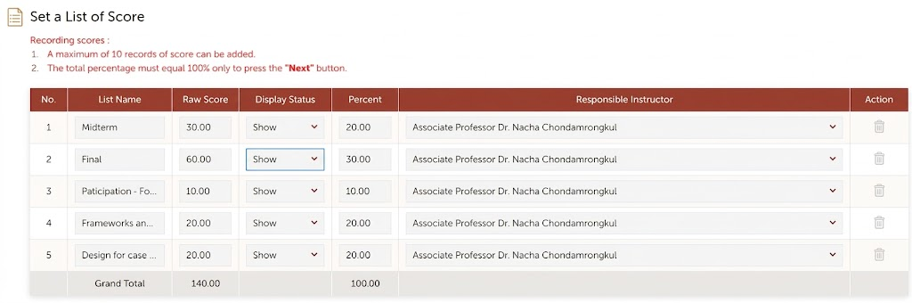
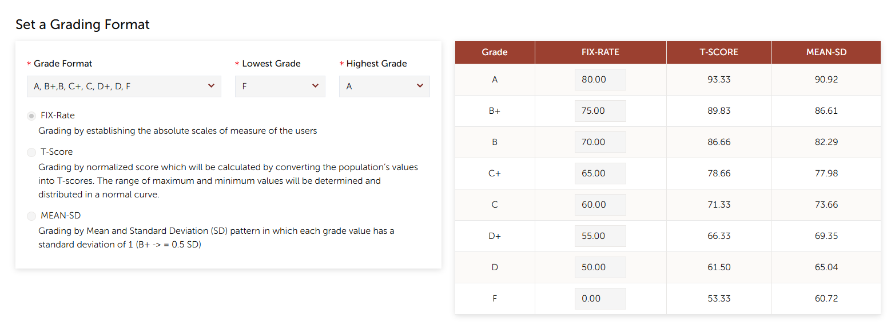

# PRD: ADT Grade Manager

| | |
|---|---|
| **Product** | ADT Grade Manager (working name) |
| **Owner** | School of Applied Digital Technology (ADT), Mae Fah Luang University |
| **Author** | nacha.cho@mfu.ac.th |
| **Status** | Draft v0.3 (open questions answered by the Acting Dean, 2026-09-23) |
| **Last updated** | 2026-09-23 |
| **Prototype** | [Clickable prototype for every role](prototype/) (sample data) |
| **Replaces** | Google Form "ADT Grade Submission" (`docs.google.com/forms/d/1Vp8lhabfDXFABCzy8axUCtqeegiq_6Mvmqmrv4W11wA`), its response Sheets, and the "School Check" sheet |

**Sources used for this draft** (Google Drive, ADT folder):
- *ADT Grade Submission 2-2025 (Responses)*: the latest form. The checklist in §6.4 is based on its questions. The sheet also holds the Program Check / School Check / Comments columns, which give the error evidence in §2.
- *ADT Grade Submission 2-2024 (Responses)* and *2-2024 - School Check*: the previous form version, which had extra upload fields.
- *ADT - Grading Guideline*: the "Practices for Grade Submission" document and its submission checklist.
- *ADT School - Grade Report Submission Process.pptx*: the current process flow.

---

## 1. Summary

At the end of each semester, ADT lecturers do the following:
1. Prepare the REG grade report and supporting documents.
2. Fill in the **ADT Grade Submission** Google Form, which uploads the files and asks self-declared Yes/No checklist questions.
3. Hand in printed documents.

The program and then the school committee check each course by hand in the response sheet before the grades go to the Registrar's Office.

The form checks nothing. Reviewers read every grade report and score summary by eye, and write the problems they find into a free-text "Comments" column. In semester 2/2025, **17 of about 90 submissions** had to be corrected after review (§2).

**ADT Grade Manager** replaces the form and the review sheet with a web app where a lecturer:

1. **Uploads** the REG grade report and score summary (Grade Entry) for a course section.
2. Gets an **automatic check for likely errors**, including the mistakes reviewers actually find: wrong use of I/M/F/U, totals over 100, REG criteria that don't match TQF3, and borderline rounding.
3. **Proves that 100% of the accumulated marks were announced to students on REG** before grades are submitted, by uploading a **screenshot of the REG score-announcement page**. This is the only evidence REG can provide (§6.3).
4. Completes the **same checklist as the old Google Form** (§6.4), with as many items as possible checked automatically.
5. Submits the course for **two rounds of review**: **Round 1 by a buddy** (a peer lecturer) and **Round 2 by the program**. In each round the reviewer **verifies every checklist item** against the evidence and marks it *Verified* or *Issue*. This replaces the Program Check / School Check / Comments columns of the sheet.

## 2. Problem statement

### 2.1 Current process (from the *Grade Report Submission Process* slides)

```
Prepare grade report & documents → Fill in Google Form checklist → Submit printed report & documents
    → Program check (with summary sheet) → School committee check (with summary sheet) → Submit to Registrar Office
```

### 2.2 Evidence from semester 2/2025

The reviewer comments in the 2/2025 response sheet show which errors the form doesn't catch:

| Error category | Cases | Examples of reviewer comments (translated) |
|---|---|---|
| **Wrong use of I / M / F / U** | 11 | "Change F to M (100+ students)"; "Student got M, but the course has no exam: give I"; "I grade: leave the score fields blank"; "I given but all score fields filled"; "Give I where U was given"; "Check that I and F match the Grade Entry"; "Change F to I" |
| **Scores not announced or not visible on REG** | 3 | "REG scores are not shown to students at all"; "Score items in REG were not printed"; "Group/Individual project marks not shown" |
| **REG grading criteria don't match TQF3** | 3 | "Grade policy in REG and TQF3 do not match"; "Adjust the REG score items to match TQF3" |
| **Accumulated score over 100%** | 1 | "Accumulated score exceeds 100%; print from *Display Calculated Score*" |
| **Borderline or rounding decision** | 1 | "Re-check the accumulated score: should 69.99 be rounded up to B? (student no. 84)" |

The response data also has many **data-quality problems** that a structured system would prevent:
- The TQF3 link points to a different course code or a different academic year.
- The template placeholder `…/[academic year]/[semester]/[course code]` was submitted unchanged.
- A Drive link was given instead of the TQF3 link.
- A course code was typed into the phone-number field.
- Several courses, or a section suffix (e.g. `1306412_Sec_01`), were typed into one course-code field.
- The same course was submitted 2–3 times.
- A course had no submission and had to be added to the sheet by hand.

### 2.3 Pain points

| Pain point | Impact |
|---|---|
| Every checklist item is self-declared. In 2/2025, almost every row answered "Yes" to everything. | The checklist doesn't separate correct submissions from wrong ones. Real errors are only found by reviewers reading the files. |
| "Shared evaluation results with students" does not verify **100%** of the marks. | Students may see their grade before they have seen every score component. This leads to appeals. |
| Reviewer findings are free text in one Comments cell, and the fix status is a second free-text cell ("แก้ไขแล้ว", i.e. "fixed"). | No per-issue tracking, no notification to the lecturer, and no history. |
| Printed documents are handed in alongside the digital ones, and nothing records what has been received. | Reviewers can't tell whether the signed exam list or the absence forms have arrived. Missing paper is found late. |
| A new form and sheet are copied every semester, and the questions drift (the 2/2024 and 2/2025 versions differ). | Semesters can't be compared. Setup is manual every time. |
| Nothing tracks which courses are missing. | The office finds missing courses by hand, close to the deadline. |

## 3. Goals and non-goals

### Goals
- **G1.** Catch the error categories in §2.2 automatically before submission. Target: at least 80% fewer "fix required" comments from reviewers, compared with 2/2025.
- **G2.** Guarantee that every approved section has **verified evidence that 100% of accumulated marks were announced on REG**, and that the announced scores match the grade report.
- **G3.** Keep **every question of the current Google Form** (§6.4). Auto-verify the ones the uploaded data can answer.
- **G4.** Replace the Program Check / School Check / Comments columns with a tracked **two-round review (buddy, then program)**. Every checklist item is verified in each round, and issues are tracked one by one.
- **G5.** **No scanning.** Signed paper documents (the final-exam name list, absence forms and the signed grade report) are handed to the **school secretary** as they are today, and never scanned or uploaded. The system records **receipt by the secretary**, so everyone can see which paper documents are in (§6.10). Only files that are already digital are uploaded: REG exports, the score spreadsheet and the REG screenshot.
- **G6.** A typical section takes 10 minutes or less from the moment the REG files are ready.
- **G7.** The UI is **dead simple for everyone**: lecturers, buddies, program reviewers and the office. A first-time user completes their task **with no training and no manual** (§6.8).
- **G8.** **Full transparency within ADT**: every ADT lecturer can view every course, its grades and its submission, including reviews and issues (§6.9).

### Non-goals (v1)
- Writing grades back into REG. Lecturers still enter and confirm official grades in REG.
- Replacing REG's Grade Entry or a lecturer's own calculation spreadsheet.
- Handling student grade appeals.
- Schools other than ADT, although the design should allow them later.
- **Anything after program approval.** The system's job ends when the program approves a section. Everything after that is handled **manually, outside the system**: any school committee check, passing the paper documents on, and sending grades to the Registrar's Office.

## 4. Users and roles

| Role | Who | Main needs |
|---|---|---|
| **Lecturer** (course coordinator) | The instructor responsible for a course section | Upload, see errors, fix them, complete the checklist, submit, track status |
| **Co-lecturer** | Other instructors on the section | View and comment. Can upload if delegated. |
| **Buddy reviewer** (Round 1) | A peer lecturer assigned to the section, not an instructor of it | Verify each checklist item against the evidence, raise issues, pass or return |
| **Program reviewer** (Round 2) | Program chair or delegate for each ADT program | Confirm the buddy's verification item by item, raise issues, approve or return |
| **School secretary** | ADT secretary who receives the paper documents | Mark each required paper document as **received** (or missing) for each section. Keep the physical file. |
| **School committee** | ADT academic committee / Dean's office | View only, like every lecturer. Any later steps they take are manual, outside the system. |
| **School office (admin)** | ADT academic services staff | Set up the semester and courses, import rosters, set deadlines, send reminders, export the approved list |
| **System admin** | IT | Users, roles, integrations, backups |

Sign-in uses MFU Google Workspace SSO (`@mfu.ac.th` only). In 2/2025 at least one lecturer submitted from a personal Gmail address, so the system should prevent that.

Roles decide only who can **change** things. **Every ADT lecturer can view everything** (§6.9).

## 5. User journeys

### 5.1 Lecturer: submit grades (a 5-step wizard)

Sign in with MFU SSO. The **course list** opens, filtered to **My courses**. Clearing the filter shows every ADT section (§6.9). Clicking a course starts or resumes the **submission wizard**. There is one step per screen, with **Back / Next** buttons and a progress bar, and each step asks for one thing (§6.8):

| Step | What the lecturer does | What the system does |
|---|---|---|
| **1. Check course** | Glances at the pre-filled course code, name, section, lecturers and TQF3 link, then clicks **Next**. | Fills everything in from the imported course list. Nothing is typed. |
| **2. Upload REG files** | Drags in the **grade report** and the **score summary** (the REG Grade Entry export or their own spreadsheet). | Detects the file types and runs the checks (§6.2) straight away. |
| **3. Paste two REG screenshots** | Follows the on-screen guide (§6.3.1), snips two REG pages with the Snipping Tool, and **pastes** each one with **Ctrl+V** into its box:<br>**(A) Set a List of Score** and **(B) Set a Grading Format**. | Shows the example image next to each box, with "make sure you can see…" hints. |
| **4. Fix problems** | Sees only the problems, each written in plain language with the fix, e.g. "3 students have F but no final exam score. Change to M in REG." Fixes them in REG and re-uploads, or explains a warning in one sentence. | Re-runs the checks on every upload. Skips this step entirely if there's nothing to fix. |
| **5. Confirm & submit** | Answers the few checklist questions the system can't check itself (§6.4). Enters the announcement date and the students' dispute deadline. Sees the **"Give to secretary"** list of paper documents (§6.10). **Chooses a buddy**, then clicks **Submit**. | Blocks Submit while any error is open. Notifies the buddy. |

The wizard saves after every step, so the lecturer can close it and come back. If a section is returned in either round, the wizard reopens at the step that has the issue, and the issues are listed one by one. Every version is kept.

### 5.2 Round 1: buddy review
1. The buddy opens the course list with the **To review as buddy** filter (or follows the link in the email), and sees their assigned sections with the review deadlines.
2. The buddy opens a submission. The **review screen is the checklist** (§6.4): one row per item. Each row shows:
   - the lecturer's answer
   - the automatic check result, where there is one
   - the evidence, opened side by side (grade report, score summary, REG screenshot, TQF3 link)
   - for paper documents, the **secretary's receipt status** instead of a file
3. For **every checklist item**, the buddy records one of:
   - **Verified**: the evidence supports the answer.
   - **Issue**: a note is required, for example "M given but the course has no final exam: should be I".
   - **N/A**: only where the item doesn't apply, for example no M grades means no absence form is needed.
4. Items that pass their automatic checks are pre-marked **Verified (auto)**. The buddy can override one to **Issue**. Items that need judgment can't be pre-marked, and the buddy must decide them: #7c/#10 (REG 100% screenshot), #15, #19 and any acknowledged warnings. The paper-document items (#8, #9, #12) are verified by the **secretary's receipt**, not by the buddy (§6.10).
5. The buddy can also raise an issue on a student row, for example a borderline 69.99.
6. **Pass to program** is only possible once every item is marked. If any item has an Issue, the only action is **Return to lecturer**.

### 5.3 Round 2: program review
1. The program reviewer opens the course list with the **To review as program** filter. Sections show the five statuses: *Not submitted · With buddy · With program · Returned · Approved*.
2. They open a submission that has passed buddy review. They see the same checklist, now with **the buddy's verdict and notes for each item**, plus:
   - the validation summary and any acknowledged warnings with their reasons
   - the grade distribution, including I/M/W/RESIGNED counts
   - a comparison with previous offerings of the course
3. For **every checklist item**, the reviewer **confirms** the buddy's verdict or marks an **Issue**. "Confirm all verified" is allowed only for items the system checked automatically. The judgment items (#7c/#10, #15, #19) must each be confirmed individually.
4. **Approve**, or **Return to lecturer**. Approval is blocked until the secretary has marked every required paper document **received**. When a returned section is resubmitted, it goes **straight back to the program (Round 2)**. The only exception is when the fix changes items the buddy had already verified: those items go back to the buddy first.

### 5.4 School office
1. Create the semester, for example 1/2569. Import the ADT course/section/lecturer list and the REG rosters. Set the deadlines for submission, buddy review and program review. Lecturers choose their own buddies (FR-5.6).
2. Monitor completion. Sections with no submission are visible from day one, instead of being found by hand.
3. Send reminders. When a program approves a section, the system's work on it is done. The office exports the approved list and continues the rest of the process **manually**.

## 6. Functional requirements

### 6.1 Uploads
- **FR-1.1** Accept the REG exports (`.xlsx`, `.xls`, `.csv`, or a PDF exported from REG), custom spreadsheets, and the REG screenshot, up to 20 MB per file. **Scans of paper documents aren't accepted.** Paper goes to the secretary (§6.10).
- **FR-1.2** Parse the known REG layouts: the Grade report, the Grade Entry with criteria details, and the Set list of scores / Display Calculated Score. A column mapper handles custom spreadsheets and remembers each lecturer's mapping.
- **FR-1.3** There are no uploads for signed or paper documents. The upload box explains this in plain words: "Signed exam lists and absence forms go to the secretary. No need to scan."
- **FR-1.4** Uploads are versioned. Only the latest version can be submitted, and earlier versions can be viewed and compared.
- **FR-1.5** The system stores the **grading criteria** from REG Grade Entry for each section, along with the TQF3 evaluation plan once it has been entered or imported (§6.2, C-17).

### 6.2 Error and consistency checks

Severity levels:
- **Error**: blocks submission.
- **Warning**: must be fixed or acknowledged with a reason.
- **Info**: shown only.

**Structure and roster**

| ID | Check | Severity |
|---|---|---|
| C-01 | A file is unreadable, or a required column (student ID, total, grade) is missing | Error |
| C-02 | A student ID is not a valid MFU ID | Error |
| C-03 | Duplicate student IDs | Error |
| C-04 | A student on the REG roster is missing from the grade report, or the reverse | Error |
| C-05 | An enrolled student has no grade | Error |
| C-06 | A grade is not in the allowed set: A, B+, B, C+, C, D+, D, F, S, U, I, M, W, RESIGNED | Error |

**Scores and totals**

| ID | Check | Severity |
|---|---|---|
| C-07 | The component weights in the score summary **don't add up to 100** | Error |
| C-08 | A student's accumulated total is **over 100**, or a component is over its maximum. *(2/2025: "the accumulated score exceeds 100%")* | Error |
| C-09 | The weighted components don't add up to the reported total (tolerance ±0.01) | Error |
| C-10 | The score summary has no average and SD. The system computes and attaches them automatically. | Info |

**Grade versus score**

| ID | Check | Severity |
|---|---|---|
| C-11 | A letter grade doesn't match the total under the section's REG criteria | Error |
| C-12 | The criteria cutoffs are non-monotonic, overlap, or leave gaps | Error |
| C-13 | A total is **within 0.5 of a cutoff**, e.g. 69.99 vs a cutoff of 70. The lecturer must confirm there is no rounding. *(2/2025: "should 69.99 be rounded to B?")* | Warning |

**Special grades** (rules taken from the *ADT - Grading Guideline*)

| ID | Check | Severity |
|---|---|---|
| C-14 | **F** is given to a student whose **final-exam score is blank** in the score summary. They are probably absent from the final, so the grade should be **M**. This is checked from the data. The paper exam list isn't needed. *(2/2025: "change F to M, 100+ students")* | Error |
| C-15 | **M** is given in a course with **no final exam** (e.g. TDS, project or studio courses). The grade should be **I**. *(2/2025: 2 cases)* | Error |
| C-16 | An **I** grade has all score fields filled. Incomplete components should be left blank. *(2/2025: 5 cases)* | Error |
| C-17 | **U** is given where the guideline calls for **I** (missing work, student has not made contact), or I and F are inconsistent with the Grade Entry. *(2/2025: 2 cases)* | Warning |
| C-18 | There are **M** grades, so the section needs Exam Absence forms. The number of M grades is shown to the secretary, who marks the forms received (§6.10). | Info |
| C-19 | A **RESIGNED** student attended the exam but has no score summary. The form requires one. | Error |
| C-20 | An **I** grade has no reason and no completion plan | Warning |

**REG, TQF3 and data quality**

| ID | Check | Severity |
|---|---|---|
| C-21 | The **grading criteria in REG don't match the TQF3 evaluation plan** (component names, weights, or grade cutoffs). A reason is needed if they differ on purpose. *(2/2025: 3 cases)* | Warning |
| C-22 | The TQF3 link doesn't match the course code, year or semester. The system generates the link, so this only applies to manual overrides. | Error |
| C-23 | The grade distribution is unusual, for example more than 50% A, more than 30% F, or a single grade for everyone. The thresholds are configurable. | Warning |
| C-24 | The distribution differs a lot from the average of the course's last 3 offerings | Info |
| C-25 | Summary of the distribution, mean and SD, and the counts of I/M/W/RESIGNED | Info |

- **FR-2.1** The checks finish within 5 seconds for 500 students.
- **FR-2.2** Each finding shows the student row, the actual value, the expected value, and a suggested fix. The suggested fix says what to change **in REG**, because REG is the source of truth.
- **FR-2.3** Admins can enable or disable each check, change its severity and set its thresholds for each semester.
- **FR-2.4** The validation report is kept with each submission version, so reviewers can see what was flagged and what was acknowledged.

### 6.3 REG 100% score announcement verification

**Rule:** before grades are submitted, students must have been able to see their accumulated scores on REG for **every** evaluation component, adding up to **100%** of the course mark. They must also have been given a deadline to review and dispute them (*Grading Guideline*, steps 2–3).

The current form only asks whether *some* results were shared ("I have shared some part of evaluation results to the students"). The *Grading Guideline* also advises lecturers to "consider disclosing less than 100%". **Decision:** 100% is required. Every component must be announced before submission, and the *Grading Guideline* will be updated to match.

**Constraint:** REG has no export or API that shows which score components are announced to students. The **only evidence is screenshots of two REG pages**, captured by the lecturer with the Windows **Snipping Tool** and pasted in. No AI or OCR is used in v1. Reviewers read the screenshots by eye.

#### 6.3.1 The two required screenshots

**(A) "Set a List of Score"**: proves that 100% was announced.



What must be visible, and what the reviewers check:
- **every row** of the table, with the List Name, Raw Score, **Display Status**, **Percent** and Responsible Instructor columns
- **Display Status = "Show" on every row.** A single "Hide" means the 100% rule is not met.
- the **Grand Total row**, with **Percent = 100.00**. REG allows at most 10 score items, and the percentages must total 100 before REG lets the lecturer continue.
- the list names match the evaluation components in TQF3 and in the uploaded score summary, including group and individual project marks, which were missing in 2/2025

**(B) "Set a Grading Format"**: shows the grade cutoffs REG uses.



What must be visible, and what the reviewers check:
- the **Grade Format**, **Lowest Grade** and **Highest Grade**, and which method is selected: **FIX-Rate**, **T-Score** or **MEAN-SD**
- the **whole cutoff table** (A … F)
- for FIX-Rate, the cutoffs match the grading policy in TQF3 (checklist #15 and #19). For T-Score or MEAN-SD, the method matches what TQF3 states.
- the cutoffs match the ones the grade report was calculated with. The system shows the cutoffs it found in the uploaded Grade Entry next to the screenshot (C-11, C-21).

- **FR-3.1** **Both screenshots are required.** Submit is blocked until box (A) and box (B) each contain an image. Each box accepts **paste from the clipboard (Ctrl+V)**, drag-and-drop, or file select. PNG and JPG are accepted. More than one image per box is allowed, for example if the list of scores needs scrolling.
- **FR-3.2** **Built-in snipping guide** next to each box, visible without clicking:
  1. Open REG → **Grade Entry** → your course and section → the **Set a List of Score** page (or **Set a Grading Format**).
  2. Press **Windows + Shift + S** (Snipping Tool), then drag a rectangle **around the whole table**, including the header row and the Grand Total row. On a Mac, press **Cmd + Ctrl + Shift + 4**.
  3. Come back and press **Ctrl + V** in the box. The snip is copied automatically, so there's no need to save a file.

  Under the steps, the **sample image** (above) is shown with the must-see parts highlighted: Display Status, Percent, Grand Total, and the cutoff table. Three "Don't" thumbnails follow: a table cut off at the right so the Display Status or Percent columns are missing, the Grand Total row missing, and a row showing "Hide".
- **FR-3.3** **No automatic reading in v1.** The review screen shows each screenshot **large, next to what the system knows**: the components and weights from the uploaded score summary for (A), and the cutoffs from the Grade Entry for (B). A tick list for the reviewer sits beside them:
  - (A): every row is "Show" · Grand Total Percent = 100.00 · the names match the score summary and TQF3
  - (B): the method is right · the cutoffs match TQF3 · the cutoffs match the grade report

  **No AI model and no API key are needed for v1.** Automatic reading is a possible later phase (§11), and would need DPO approval.
- **FR-3.4** **Lecturer declaration (Confirm):**
  - "All evaluation components, totalling 100%, are announced to students on REG, as shown in the attached screenshot."
  - The **announcement date** and the **review/dispute deadline** given to students. Students must have had **at least 3 days** between the announcement and the deadline, and the deadline must be before submission. The system warns otherwise.
  - "If there are any missing marks, I have already communicated with the students."
- **FR-3.5** **Two-round confirmation (required):** in both rounds, the reviewer sees both screenshots next to the Grade Entry components, weights and cutoffs, with the tick list from FR-3.3. The **buddy** must mark **"REG 100% announcement verified"** (or Issue), and the **program reviewer** must confirm it. Neither can pre-mark it automatically.
- **FR-3.6** The dashboard shows a badge for each section: **REG 100%: Missing / Uploaded / Verified by buddy / Confirmed by program / Issue raised**.
- **FR-3.7** Future: if REG ever provides an export or API for announcement status, it replaces the screenshot (Q2).

### 6.4 Submission checklist (migrated from the Google Form)

Every question of the **2/2025 ADT Grade Submission form** is kept, in its original order and wording, so records stay comparable across semesters. Each item gets one of these types:
- **Auto**: verified by the system from the uploaded data. Ticked and locked, with a link to the evidence.
- **Confirm**: the lecturer answers Yes/No. A reason is needed where the form had an "Other" option.
- **Prefill**: data the system fills in, which the lecturer can correct.
- **Upload**: a required or optional file.

| # | Question in the Google Form | Answers in the old form | New type | How it is satisfied in the new system |
|---|---|---|---|---|
| 1 | Email Address | text | Prefill | From SSO. `@mfu.ac.th` only. |
| 2 | Mobile Phone Number | text | Prefill | Saved in the lecturer profile and validated as a phone number. |
| 3 | Course Code | text | Prefill | Chosen from the imported section list, one section per submission. This removes free-text codes like `1306412_Sec_01`. |
| 4 | Course Name | text | Prefill | From the course list. |
| 5 | URL link to TQF3 | text | Auto | Generated as `tqf.mfu.ac.th/#/pdf/{year}/{sem}/{course}` (C-22). |
| 6 | Grade report (From REG system) | Yes | Upload + Auto | Parsed. Checks C-01 to C-06 and C-11. |
| 7 | Score summary (or Grade entry from REG) | *Grade entry from REG (with criteria details noted)* / *In custom spreadsheet* (either or both) | Upload + Auto | Parsed. Checks C-07 to C-10. The source type is recorded. |
| 7a | *(2/2024 form)* URL link to the custom spreadsheet used to calculate scores (if any) | text | Upload (optional) | Upload the file itself instead of a link. |
| 7b | *(2/2024 form)* Set list of scores (from REG, at the bottom of the Grade Entry Criterion page) | Yes | Upload | Supporting document. |
| 7c | **Screenshots of the REG "Set a List of Score" and "Set a Grading Format" pages** (to be added to the form) | image | **Paste (required)** + Reviewer confirm | The REG 100% evidence and the cutoff evidence (§6.3.1). Both are checked by eye by the buddy and the program. |
| 8 | Exam's student list with signature for the final exam | Yes / blank | **Paper → secretary** | Required if the course has a final exam. The secretary marks it received. Not scanned. |
| 9 | Student's Exam Absence form (if available) | Yes / No | **Paper → secretary** | Required for each M grade. The secretary marks how many were received against the M count (C-18). Not scanned. |
| 10 | I have shared some part of the evaluation results with the students. | Yes / No | Confirm (stricter) + Reviewer confirm | Replaced by the **100% declaration** plus the screenshot (#7c). Confirmed by the buddy and the program (§6.3). |
| 11 | If there are any missing marks, I have already communicated with the students. | Yes / No | Confirm | §6.3, R-6. Warning if the answer is No while I grades exist. |
| 12 | I have signed the grade report. | Yes / No | **Paper → secretary** | The signed grade report is handed to the secretary, who marks it received. Not scanned. |
| 13 | The score summary includes a total score of 100. | Yes / No | **Auto** | C-07, C-08. |
| 14 | The score summary includes statistical details such as average and SD. | Yes / No | **Auto** | C-10. The system computes them. |
| 15 | The grading policy is included in the evaluation plan in TQF3. | Yes / No | Confirm + Auto | Confirm, then checked against the TQF3 plan (C-21). |
| 16 | This class includes students who resigned (RESIGNED is given). The score summary must be provided if they attended the examination. | Yes / No | **Auto** | Detected from the grades. C-19. |
| 17 | This class includes students who withdrew (W is given). | Yes / No | **Auto** | Detected from the grades. |
| 18 | This class includes students absent from the final exam (M is given). | Yes / No | **Auto** | Detected from the grades. Checks C-14, C-15 and C-18. |
| 19 | Grading policy: does the score summary align with the evaluation criteria in the course syllabus (TQF3)? If not, give the reason in "Other". | Yes / Other (reason) | Auto + Confirm | C-21. A reason is required when they differ, e.g. "changed due to learning activities". |
| — | *(Review sheet)* Program Check | TRUE / FALSE | Workflow | Replaced by **Round 1 (buddy)** and **Round 2 (program)**, with a verdict for each item (§6.5). |
| — | *(Review sheet)* School Check | TRUE / FALSE | Not in system | Beyond program approval, so handled manually. The historical values are kept in the import (FR-4.2). |
| — | *(Review sheet)* Comments / fix status | free text | Workflow | Issues on each item, with open/resolved status. |

**Review verdicts for each item.** Every row above (#1–#19, #7a–#7c) has two review columns: **Buddy verdict** and **Program verdict**. Each is Verified / Issue (with a note) / N/A. The table below sets how each item is reviewed:

| Item type | Buddy (Round 1) | Program (Round 2) |
|---|---|---|
| Prefill (#1–#5) | Pre-marked Verified (auto). Can override. | Bulk confirm allowed |
| Auto, check passed (#6, #7, #13, #14, #16–#18) | Pre-marked Verified (auto). Buddy should spot-check the evidence and can override. | Bulk confirm allowed |
| Auto, warning acknowledged by the lecturer | **Must decide.** Is the reason acceptable? | **Must confirm individually** |
| Judgment (#7c/#10 REG 100% screenshot, #11, #15, #19) | **Must decide.** Opens the evidence. | **Must confirm individually** |
| Paper (#8, #9, #12) | Shows the secretary's receipt status. Read-only for the buddy. | Approval blocked until all are **received** |

**Result:** 8 of the 16 self-declared Yes/No items (#6–#19) become fully or partly **automatic**. Three (#8, #9, #12) are confirmed by the **secretary's receipt of the paper document**. The REG 100% item (#10) is backed by a required screenshot and a reviewer's confirmation, and the only purely self-declared item left is #11.

> **Baseline (decided):** the **2/2025 form as-is**, plus the REG screenshot upload (#7c). The list was built from the column headers of the 2/2025 response sheet. The extra 2/2024 items (#7a, #7b) are kept as optional uploads.

- **FR-4.1** Admins can edit the checklist for each semester (add, reorder, change type) without a code change. The version used is stored with each submission.
- **FR-4.2** A one-time **import of past response sheets** (2/2024, 1/2024 and 2/2025), including the Program Check / School Check / Comments columns, so reports cover earlier semesters.

### 6.5 Review and approval workflow
- **FR-5.1** Status flow:
  ```
  Draft → Submitted
        → Round 1: Buddy review ──(Issue)──→ Returned → Resubmitted → Round 1
        → Round 2: Program review ──(Issue)──→ Returned → Resubmitted → Round 2
                                     (items the buddy had verified and the fix changed go back to the buddy first)
        → Program approved (locked). The system's scope ends here. Everything after is manual.
  ```
- **FR-5.2** **Verification against the checklist:** each round stores a verdict for **every checklist item** (Verified / Issue / N/A), along with the reviewer, a timestamp, and a note that is required for Issue and N/A. A round can't be completed while any item has no verdict.
- **FR-5.3** **Issues:** reviewers raise issues on a checklist item, an automatic check, a student row, or the whole section. Each issue stays open until the lecturer fixes it and **the reviewer who raised it** resolves it. This replaces the "Comments" and "แก้ไขแล้ว" ("fixed") cells.
- **FR-5.4** **Round rules:**
  - The buddy can't be an instructor of the section.
  - The program reviewer can't be the section's buddy or an instructor of it.
  - A lecturer can't review their own section in either round.
  - On resubmission, earlier verdicts are kept. Items affected by the changed files are **reset**, and must be verified again.
- **FR-5.5** Email notifications (MFU mail):
  - on submit (to the buddy)
  - on passing to the program (to the program reviewer)
  - on return and on new issues (to the lecturer)
  - on approval
  - deadline reminders for each stage (T-3 days, T-1 day, overdue)
- **FR-5.6** **The lecturer chooses their buddy when submitting:**
  - The Submit step has a single "Choose your buddy" box, which searches **any ADT lecturer**. It excludes the lecturer themselves and anyone teaching the section.
  - Beside each name, the box shows how many sections that person already has waiting, so lecturers can spread the load.
  - The buddy is notified, and can **accept** or **decline**. If they decline, the section returns to the lecturer, who chooses someone else.
  - The office can see every pairing and can step in if needed, for example when a buddy is unavailable. No up-front assignment is needed.
- **FR-5.7** A **review summary** is generated for each section: the checklist, both rounds' verdicts, and the issue history. It replaces the summary sheet reviewers receive today, and can be exported as PDF for the manual steps after approval.
- **FR-5.8** Only an admin can reopen a locked section, and must record a reason, for example a grade change after an appeal.

### 6.6 Dashboards and exports
- **FR-6.1** **One course list for everyone**: every ADT section in the semester, with its status and REG 100% badge, searchable by course code, name or lecturer. Quick filters: **My courses**, **To review as buddy**, **To review as program**, **Paper to receive** (secretary), **All**. There are no separate dashboards to learn. The filters do the job.
- **FR-6.2** A summary strip at the top of the list, visible to everyone:
  - completion by program and by stage (not started / buddy review / program review / approved), including sections **not started**
  - overdue buddy reviews and buddy workload
  - the REG 100% badge
  - the count of open issues
  - I/M/W/RESIGNED counts
  - the grade distribution for each course, compared with previous offerings
- **FR-6.3** Exports:
  - a completion report (`.xlsx`)
  - an **approved-sections list** (`.xlsx`) for the manual process after approval
  - a checklist export in the same column layout as the old response sheet, so it stays continuous with past records

### 6.7 Audit and records
- **FR-7.1** Every action (upload, acknowledgement, checklist answer, submit, issue, approve, reopen) is logged with the user and a timestamp. Viewing and downloading another lecturer's files are logged too (§6.9).
- **FR-7.2** Records are kept for at least 5 years, or longer if MFU's records policy requires.

### 6.8 Dead-simple UI

The system must be usable by every lecturer, including those who rarely use web tools, **with no training**. These are requirements, not suggestions.

- **FR-8.1** **Three screens in total:**
  1. **Course list**: everyone, every section (FR-6.1).
  2. **Course page**: one page per section. It opens as the **submission wizard** for the section's lecturer until submitted, and otherwise shows everything about the section (files, checks, checklist, reviews, issues, history).
  3. **Admin**: office only.
  There are no other screens, pop-ups or separate dashboards. The wizard is part of the course page.
- **FR-8.2** **Submission is a 5-step wizard** (§5.1): **① Check course → ② Upload REG files → ③ Paste screenshots → ④ Fix problems → ⑤ Confirm & submit**. Each step is one screen asking for one thing, with a progress bar, **Back / Next**, and one primary button. Step ④ is skipped when there is nothing to fix. When the wizard is finished, the course page shows the section's status, its review rounds and its history.
- **FR-8.3** **Uploading is effortless.** Files are dragged into one box, and the system works out which is the grade report and which is the score summary. Screenshots are **pasted with Ctrl+V** straight from the Snipping Tool, with the guide and sample image beside each box (FR-3.2). Nothing is typed that the system already knows. Paper documents never appear as uploads. They appear as a short "Give to secretary" list.
- **FR-8.4** **Problems are written in plain language, with the fix**, for example "3 students have F but no final exam score. They were probably absent: change to M in REG." Error codes (C-xx) are hidden from lecturers and shown only in a details view for reviewers and admins.
- **FR-8.5** **The checklist and the review use the same table.** One row per item, with at most three buttons per row: **✓ Verified**, **✗ Issue**, **N/A**. The evidence opens in a side panel without leaving the page. A buddy or program reviewer sees exactly what the lecturer saw, with their own column added.
- **FR-8.6** **Five statuses everywhere**, shown as coloured labels with text: *Not submitted · With buddy · With program · Returned · Approved*. The same words are used in the list, the page and the emails.
- **FR-8.7** **Every email has one link** that opens the exact course page, with the action waiting. There is no need to search.
- **FR-8.8** **Language:** a one-click Thai / English switch. The same plain wording is used in both.
- **FR-8.9** **Forgiving:** drafts save automatically. Re-uploading replaces the file and keeps the history. Nothing is lost by closing the browser.
- **FR-8.10** **Usability acceptance test before the pilot:** 5 lecturers and 2 reviewers who have never seen the system complete submit, buddy review and program review **without help**. The median is 10 minutes or less for a submission and 5 minutes or less for a review. Every step where someone got stuck is fixed before launch.

### 6.9 Visibility: everything is open to all ADT lecturers

- **FR-9.1** **Every signed-in ADT lecturer can view every section in every semester**, whether or not they teach it:
  - course details and lecturers
  - uploaded files (grade report, score summary, REG screenshot) and the receipt status of the paper documents
  - student grades and scores
  - validation results and acknowledged warnings
  - the checklist and both review rounds' verdicts
  - issues and their history
  - the grade distribution
- **FR-9.2** **Viewing is open, and changing is restricted:**

  | Action | Who |
  |---|---|
  | View anything | All ADT lecturers, reviewers, office |
  | Upload, fix, submit, acknowledge warnings | The section's lecturers |
  | Round 1 verdicts, raise or resolve buddy issues | The assigned buddy |
  | Round 2 verdicts, approve or return | The program reviewer |
  | Comment on any section (without a verdict) | Any ADT lecturer |
  | Mark paper documents received or missing | School secretary |
  | Choose the buddy | The section's lecturer (at submission) |
  | Setup, reassign a buddy if needed, reopen, exports | Office / admin |

- **FR-9.3** **Access is limited to ADT staff.** Viewing requires MFU SSO *and* membership of the ADT staff list maintained by the office. Students and staff outside ADT have no access.
- **FR-9.4** **Personal contact data isn't part of the "open" set.** Lecturer phone numbers are visible only to the office and to the section's reviewers.

### 6.10 Paper documents: handed to the secretary, never scanned

Signed documents stay on paper. The system tracks **whether they have been received**, not their content.

- **FR-10.1** **Required paper documents** are listed automatically for each section:

  | Document | Required when |
  |---|---|
  | Signed final-exam name list | The section has a final exam (flag set by the office, FR-10.7) |
  | Student Exam Absence form | Once for each student with an **M** grade (count taken from the grade report) |
  | Signed grade report | Always |

- **FR-10.2** The lecturer's course page shows these as a **"Give to secretary"** checklist with a status for each: *Awaiting secretary · Received · Missing*. Nothing needs uploading.
- **FR-10.3** **Secretary view:** no extra screen is needed. The secretary uses the course list with the **Paper to receive** filter, which shows each section and the paper documents it needs, with the tick boxes right in the list. The secretary ticks **Received** when a document is handed in. For absence forms, they enter the number received, which is checked against the M count. They can mark **Missing**, with a note, which notifies the lecturer. Each tick records the secretary's name and the time.
- **FR-10.4** The secretary can search by course code or lecturer, so they can tick everything a lecturer hands in at the counter at once.
- **FR-10.5** A buddy can review before the paper arrives. **Program approval is blocked** until every required paper document is *Received*.
- **FR-10.6** No scan or photo of a paper document is stored anywhere in the system. The physical file stays with the secretary.
- **FR-10.7** **The "has a final exam" flag is set by the office** for each section, when the course list is imported each semester. It is used by C-14, C-15 and FR-10.1. Lecturers can see it, and can ask the office to correct it.

## 7. Non-functional requirements

| Area | Requirement |
|---|---|
| **Security & privacy** | MFU SSO plus the ADT staff list only. **All ADT lecturers can view all sections**. Editing is role-based (§6.9). Views and downloads are logged. Complies with Thailand's PDPA, subject to a DPO review of the open-visibility policy (R3). TLS in transit and encryption at rest. Emails contain links, never student data. Phone numbers are visible only to the office and reviewers. |
| **Hosting** | MFU-managed infrastructure or an approved cloud. |
| **Performance** | Validation finishes in 5 seconds or less for 500 students. Pages load in under 2 seconds on campus. |
| **Availability** | 99.5% during the submission window, which usually falls in the second week of May and the first half of December. |
| **Usability** | Dead simple (§6.8): three screens, one primary action per screen, plain-language messages, no training needed. Thai and English UI. Desktop browsers. The course list and the course page can be read on mobile. |
| **Accessibility** | WCAG 2.1 AA for core flows. |
| **Backup** | Daily backups, with a restore tested each semester. |

## 8. Data model (high level)

- **Semester**: year and term, deadlines, active checks, checklist version.
- **Program → Course → Section**: lecturers, roster, whether the course has a final exam, REG criteria, TQF3 plan.
- **Student**: ID and name. **Enrollment** links a student to a section.
- **Submission → Version**: the files, parsed rows, validation results, REG announcement evidence, checklist answers and acknowledgements.
- **BuddyAssignment**: section, buddy, chosen by (the lecturer), when, and accepted or declined.
- **ReviewRound**: round (1 = buddy, 2 = program), reviewer, version reviewed, started and completed times, outcome (passed/approved or returned).
- **ItemVerdict**: review round, checklist item, verdict (Verified / Issue / N/A), whether it was set automatically, and a note.
- **PaperDocument**: section, type (exam list / absence form / signed grade report), number required, number received, status, received by, and when.
- **Issue**: raised by, round, target (checklist item, check, row or section), status.
- **AuditLog**.

## 9. Integrations

| System | v1 | Later |
|---|---|---|
| MFU Google Workspace SSO | Sign-in | — |
| REG (reg.mfu.ac.th) | Upload of the Grade report and Grade Entry exports, plus an imported roster. The **100% announcement is a screenshot only**, since REG has no export for it. | API or DB view for the roster, criteria, announcement status and final grades |
| TQF system (tqf.mfu.ac.th) | Generated link | Read the evaluation plan to automate C-21 |
| MFU email | Notifications | — |
| Google Sheets (old responses) | One-time import (FR-4.2) | — |

## 10. Success metrics

- 100% of ADT sections submit through the system by the second semester after launch.
- 100% of approved sections have a REG announcement screenshot **verified by the buddy and confirmed by the program**.
- 100% of approved sections have a verdict on every checklist item in both rounds.
- At least 70% of the issues that reach program review have already been caught by the buddy, so Round 2 finds few new problems.
- The median buddy review takes 2 working days or less.
- "Fix required" reviewer issues fall by at least 80% compared with the 2/2025 baseline (17 of about 90).
- Zero I/M/F/U misuse issues found after submission, because they are caught by C-14 to C-17.
- Zero duplicate or missing section submissions.
- The median time from first upload to submit is 10 minutes or less.
- Lecturer satisfaction is at least 4/5, with a System Usability Scale (SUS) score of 80 or more.
- 90% or more of lecturers submit their first section without asking the office for help.

## 11. Rollout plan

| Phase | Scope | Timing (proposed) |
|---|---|---|
| **0: Discovery** | Collect sample REG exports (Grade report, Grade Entry) and **10 or more sample screenshots of the REG Grade Entry score items page** for the example image. Update the *Grading Guideline* to require 100% announcement. Interview 3–5 lecturers and reviewers. | Oct 2026 |
| **1: MVP** | Uploads and parsers, checks C-01 to C-19, REG screenshot evidence (read by eye, no AI), the migrated checklist, buddy chosen by the lecturer, the **two-round review (buddy → program)** with a verdict on each item, the dashboard | Nov 2026 |
| **2: Pilot** | Semester 1/2569 (grades due early Dec 2026), 1–2 programs, with the Google Form kept as backup | Dec 2026 |
| **3: School-wide** | All ADT programs for semester 2/2569 (May 2027). Retire the Google Form and the printed checklist. Import historical responses. | May 2027 |
| **4: Enhancements** | Automating C-21 against TQF3, REG API integration, optional automatic reading of the REG screenshot (AI or OCR, after DPO approval), appeals | Ongoing |

## 12. Open questions and risks

| # | Item | Owner |
|---|---|---|
| ~~Q1~~ | **Resolved:** the baseline is the 2/2025 form as-is, plus the REG screenshot upload. | — |
| Q2 | Can REG export the Grade report and Grade Entry criteria in a stable format? Could it ever expose the announcement status, so the screenshot is no longer needed? | IT / REG office |
| ~~Q2b~~ | **Resolved:** two Snipping Tool screenshots, of the REG **Set a List of Score** page and the **Set a Grading Format** page (§6.3.1, with samples). | — |
| ~~Q3~~ | **Resolved:** 100% announcement is required, and the *Grading Guideline* will be updated. | — |
| ~~Q4~~ | **Resolved:** at least **3 days** between the announcement and the students' dispute deadline, with the deadline before submission. | — |
| ~~Q5~~ | **Resolved:** follow the *Grading Guideline* as it is. **M** means absent from the final exam, and is only used in courses with a final. **I** means missing work with no contact from the student, and the incomplete score fields are left blank. Courses with no final never use M. | — |
| ~~Q6~~ | **Resolved:** the **office** sets the "has a final exam" flag for each section when it imports the course list (FR-10.7). | — |
| ~~Q7~~ | **Resolved:** the system doesn't track anything after program approval. Passing paper on and sending grades to the Registrar are manual. | — |
| ~~Q8~~ | **Resolved:** there is no ADT-wide rule. The system warns on borderline totals, and the **lecturer decides and confirms**. | — |
| ~~Q9~~ | **Resolved:** program approval is the last step in the system. Any school-level check afterwards is manual. | — |
| ~~Q10~~ | **Resolved:** the section goes back to the **program**. Items the buddy had verified and the fix changed go back to the buddy first. | — |
| ~~Q11~~ | **Resolved:** the **lecturer chooses** any ADT lecturer as buddy when submitting. The buddy can decline. | — |
| Q12 | How many days does a buddy have to review? Suggested: 2 working days. | School office |
| R1 | REG export formats may change without notice. Mitigation: versioned parsers, plus a manual column mapping as fallback. | Product |
| R2 | The 100% evidence is a screenshot, which can be cropped, from the wrong section, or out of date. Mitigations: an example image, the screenshot shown next to the Grade Entry components, and required confirmation by both the buddy and the program. | Product |
| R5 | Buddies may rubber-stamp by accepting auto-verified items without looking. Mitigations: judgment items can't be bulk-marked, a spot-check prompt, and reports comparing Round 2 findings with Round 1. | Product |
| R6 | A buddy review adds a stage, which squeezes a tight deadline. Mitigations: a separate buddy deadline, reminders, a buddy can decline quickly, and the office can reassign. | School office |
| R4 | If automatic screenshot reading is added later, its accuracy on Thai and English screenshots is uncertain. Mitigation: it would only assist, never block, and reviewers would still confirm by eye. | Product |
| R3 | PDPA: **every ADT lecturer can see all students' grades and scores**, including students they don't teach, and the system also stores lecturer phone numbers. Mitigations:<br>• a DPO review of the open-visibility policy before the pilot, with the lawful purpose documented as academic quality assurance and peer review<br>• ADT staff only (FR-9.3)<br>• views and downloads are logged<br>• phone numbers are restricted (FR-9.4)<br>If the DPO requires it, fallback option: other lecturers see **student IDs masked** (e.g. 6531xxxx12) while everything else stays visible. | Product / DPO |
| R8 | When lecturers choose their own buddy, friends may review each other lightly. Mitigations: the program still verifies every judgment item one by one, and reports compare what Round 2 found with Round 1 for each buddy. | Dean's office |
| R7 | Open visibility may make some lecturers uncomfortable, for example about their grade distributions being compared. Mitigations: communicate that the purpose is shared quality and peer learning, not ranking, and don't build a lecturer leaderboard. | Dean's office |

## 13. Future ideas
- Grade-change requests after approval
- A student-facing status view
- Reports for AUN-QA and TQF5, built from the stored distributions
- Expansion to other MFU schools
